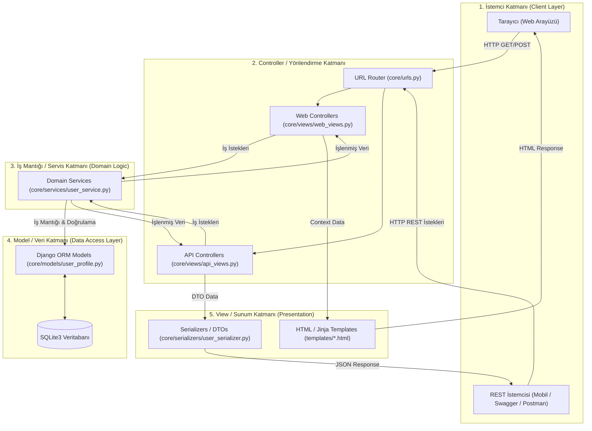

# 🎓 Alumni Portal (Alumni Management System)

[](https://www.python.org/)
[](https://www.djangoproject.com/)
[](https://www.sqlite.org/)
[](./swagger.json)
[](#-mimari-tasarım-django-mvtden-temiz-mvcyeye)
[-brightgreen.svg)](#-test-ve-kalite-güvencesi)

> **Web Programlama (Web Programming)** dersi kapsamında geliştirilen; mezunlar, öğrenciler ve üniversite yönetimi arasında köprü kurmayı hedefleyen modern, modüler ve yüksek standartlı bir **Mezun Yönetim Portalı** (Alumni Management Platform).

---

## 📌 İçindekiler

- [📖 Proje Hakkında ve Vizyon](#-proje-hakkında-ve-vizyon)
- [🏛️ Mimari Tasarım: Django MVT'den Temiz MVC'ye](#-mimari-tasarım-django-mvtden-temiz-mvcyeye)
  - [Sorumlulukların Ayrımı (Separation of Concerns - SoC)](#sorumlulukların-ayrımı-separation-of-concerns---soc)
  - [Katmanlı Mimari Şeması](#katmanlı-mimari-şeması)
- [📂 Proje Dizin Yapısı](#-proje-dizin-yapısı)
- [🛠️ Teknoloji Yığını](#️-teknoloji-yığını)
- [✨ Temel Özellikler](#-temel-özellikler)
- [🚦 Gerçekleştirilen Rotalar ve API Kataloğu](#-gerçekleştirilen-rotalar-ve-api-kataloğu)
- [📄 Swagger / OpenAPI 3.0 Dokümantasyonu](#-swagger--openapi-30-dokümantasyonu)
- [💻 Yerel Kurulum ve Çalıştırma (Local Development)](#-yerel-kurulum-ve-çalıştırma-local-development)
- [🧪 Test ve Kalite Güvencesi](#-test-ve-kalite-güvencesi)
- [🧭 Geliştirici Kılavuzu ve Kod Standartları](#-geliştirici-kılavuzu-ve-kod-standartları)
- [🗺️ Yol Haritası (Roadmap)](#️-yol-haritası-roadmap)

---

## 📖 Proje Hakkında ve Vizyon

**Alumni Portal**, üniversite mezunlarının kariyer gelişimlerini desteklemek, mevcut lisans/önlisans öğrencileri ile mezunlar arasında mentorluk ve staj/iş bağlantıları kurmak, üniversite etkinlik ve duyurularını tek bir çatı altında toplamak amacıyla tasarlanmıştır.

Proje, kurumsal yazılım standartlarına uygun olarak geliştirilmekte olup; **sürdürülebilirlik**, **yüksek test kapsamı**, **açık API dokümantasyonu** ve **katmanlı mimari prensipleri** ön planda tutulmaktadır.

---

## 🏛️ Mimari Tasarım: Django MVT'den Temiz MVC'ye

Geleneksel Django projeleri **MVT (Model-View-Template)** deseni üzerinde şekillenir. Ancak modern kurumsal uygulamalarda bu yaklaşım sıklıkla `views.py` dosyalarının aşırı büyümesine (*Fat Views anti-pattern*), iş mantığının (business logic) sunum kodlarına karışmasına ve kodun test edilebilirliğinin düşmesine yol açar.

Bu projede, Django'nun yerleşik gücü korunarak **Temiz MVC (Model-View-Controller)** ve **Servis Odaklı Katmanlı Mimari (Service-Layered Architecture)** prensipleri standardize edilmiştir:



### Sorumlulukların Ayrımı (Separation of Concerns - SoC)

| Klasik MVC | Django Karşılığı | Projedeki Konumu | Sorumluluk ve İlkeler |
| :--- | :--- | :--- | :--- |
| **Model (M)** | Model | `core/models/` | **Veri & Şema Katmanı:** Veritabanı tablolarının temsili, veri bütünlüğü kısıtlamaları, ORM tanımları ve meta bilgiler. Kesinlikle doğrudan HTTP veya sunum mantığı içermez. |
| **View (V)** | Template & Serializer | `templates/` & `core/serializers/` | **Sunum Katmanı (Presentation):** Kullanıcıya gösterilecek çıktının hazırlanması. Web için HTML şablonları; REST API için veri dönüşümü, doğrulama (validation) ve DTO (Data Transfer Object) çıktıları. |
| **Controller (C)** | View & Routing | `core/views/` & `core/urls.py` | **İstek Karşılama & Orkestrasyon:** Gelen HTTP isteklerini yakalar, parametreleri ayıklar, ilgili servis katmanını çağırır ve uygun HTTP durum kodu (Status Code) ile yanıtı döner. |
| **Service Layer** | Business Logic | `core/services/` | **Temel İş Mantığı (Domain Logic):** Veritabanı sorgu orkestrasyonu, iş kuralları, validasyon kuralları ve domain operasyonları burada icra edilir (*Skinny Controller, Rich Service*). |

---

## 📂 Proje Dizin Yapısı

Standardize edilmiş proje dizini, sorumlulukların net ayrımı gözetilerek aşağıdaki şekilde organize edilmiştir:

```text
alumni/
├── manage.py                   # Django yönetim komut satırı aracı
├── requirements.txt            # Proje bağımlılıkları ve kütüphaneler
├── swagger.json                # OpenAPI 3.0 REST API spesifikasyon dosyası
├── db.sqlite3                  # SQLite veritabanı dosyası (ACID uyumlu)
├── README.md                   # Proje ana dokümantasyonu ve mimari rehber
├── model.py                    # [Domain Model] DB bağımsız saf Python User sınıfı
├── user.py                     # [In-Memory CRUD] DB bağımsız User CRUD fonksiyonları
├── announcement_model.py       # [Domain Model] DB bağımsız saf Python Announcement sınıfı
├── announcement.py             # [In-Memory CRUD] DB bağımsız Announcement CRUD fonksiyonları
├── controllers.py              # [MVC Controllers] Controller köprüsü
├── test_in_memory_user.py      # [Unit Tests] In-memory model ve User CRUD testleri
├── test_controllers.py         # [Unit Tests] User Controller test paketi
├── test_announcements.py       # [Unit Tests] Announcement model, CRUD ve Controller testleri
│
├── core/                       # Çekirdek uygulama ve proje konfigürasyonu
│   ├── __init__.py
│   ├── apps.py                 # Core uygulama yapılandırması
│   ├── settings.py             # Django global ayarları (DB, Templates, Apps)
│   ├── urls.py                 # Merkezi rota tanımları ve URL mapping
│   ├── wsgi.py                 # WSGI web sunucu giriş noktası
│   ├── asgi.py                 # Asenkron ASGI giriş noktası
│   ├── model.py                # Core paketi için model köprüsü
│   ├── user.py                 # Core paketi için user CRUD köprüsü
│   ├── views.py                # Controller delegasyonları ve view yönlendirmeleri
│   │
│   ├── controllers/            # [C] CONTROLLER KATMANI (Temiz MVC)
│   │   ├── __init__.py
│   │   ├── user_controller.py             # UserController: Web HTML şablon ve form CRUD
│   │   ├── api_user_controller.py         # ApiUserController: REST API JSON CRUD
│   │   ├── announcement_controller.py     # AnnouncementController: Web HTML Duyuru CRUD
│   │   ├── api_announcement_controller.py # ApiAnnouncementController: REST API Duyuru CRUD
│   │   ├── user_urls.py                   # Web User rotaları
│   │   ├── api_urls.py                    # REST API User rotaları
│   │   ├── announcement_urls.py           # Web Announcement rotaları
│   │   └── api_announcement_urls.py       # REST API Announcement rotaları
│   │
│   ├── models/                 # [M] MODEL KATMANI: Veritabanı ORM modelleri
│   │   ├── __init__.py
│   │   └── user_profile.py     # UserProfile modeli (ad, doğum tarihi, şehir, okul)
│   │
│   ├── views/                  # [Presentation/Routing]: HTTP işleyicileri
│   │   ├── __init__.py
│   │   ├── api_views.py        # REST API Controller köprüsü
│   │   ├── web_views.py        # Web Controller köprüsü
│   │   └── demo_views.py       # Temel rota ve matematiksel hesaplama view'ları
│   │
│   ├── services/               # [C/Domain] SERVİS KATMANI: İş mantığı operasyonları
│   │   ├── __init__.py
│   │   └── user_service.py     # Kullanıcı kayıt, arama, güncelleme, silme servisleri
│   │
│   ├── serializers/            # [V] PRESENTATION KATMANI: API DTO & Validasyon
│   │   ├── __init__.py
│   │   └── user_serializer.py  # UserProfile DTO, dict/json dönüşümü ve validasyon
│   │
│   ├── migrations/             # Veritabanı şema göç dosyaları
│   │   ├── __init__.py
│   │   └── 0001_initial.py     # İlk kullanıcı modeli şema migrasyonu
│   │
│   └── tests/                  # [QA] TEST KATMANI: Kapsamlı test paketleri
│       ├── __init__.py
│       ├── test_models.py      # Model birim testleri
│       ├── test_serializers.py # Serializer / DTO testleri
│       ├── test_services.py    # İş mantığı ve servis testleri
│       ├── test_api_views.py   # REST API uç nokta entegrasyon testleri
│       ├── test_web_views.py   # Web şablon ve sayfa testleri
│       └── test_demo_views.py  # Demo ve yardımcı rota testleri
│
└── templates/                  # [V] VIEW KATMANI: HTML Görünümleri
    ├── index.html              # Ana karşılama sayfası ve interaktif rota test paneli
    ├── about.html              # Proje hakkında bilgilendirme sayfası
    ├── users.html              # Kullanıcı kayıt formu ve dinamik veri tablosu
    └── swagger.html            # Canlı Swagger UI REST API dokümantasyon arayüzü
```

---

## 🛠️ Teknoloji Yığını

| Katman | Teknoloji | Açıklama |
| :--- | :--- | :--- |
| **Backend Dili** | [Python 3.11+](https://www.python.org/) | Tip güvenliği ve modern Python özellikleri |
| **Web Çatısı** | [Django 6.1+](https://www.djangoproject.com/) | Kurumsal seviye MVC web mimarisi |
| **Veritabanı** | [SQLite3](https://www.sqlite.org/) | Hafif, dosya tabanlı, yerel geliştirme için sıfır-konfigürasyon ACID veritabanı |
| **API Standartı** | [OpenAPI 3.0.0](https://swagger.io/specification/) | Endüstri standardı REST API şeması |
| **API Arayüzü** | [Swagger UI](https://swagger.io/tools/swagger-ui/) | Etkileşimli API test ve dokümantasyon konsolu |
| **Frontend** | HTML5, CSS3, JavaScript | Modern, duyarlı ve kullanıcı dostu arayüzler |
| **Test Çerçevesi** | Django Test Framework (unittest) | Otomatize birim ve uçtan uca entegrasyon testleri |

---

## ✨ Temel Özellikler

- **🔒 Rol Tabanlı Yetkilendirme Altyapısı (RBAC Temeli):** Öğrenci, mezun ve yönetici rolleri için genişletilebilir mimari.
- **⚡ Kapsamlı Kullanıcı CRUD Sistemi:**
  - Web üzerinden kolay form girişi ve tablo üzerinde gerçek zamanlı listeleme.
  - REST API üzerinden standart HTTP fiilleri (`GET`, `POST`, `PUT`, `PATCH`, `DELETE`) ile tam yönetim.
- **🧩 Çift Dilli Parametre Desteği:** API isteklerinde ve formlarda hem Türkçe (`isim`, `dogum_tarihi`, `sehir`, `okul`) hem de İngilizce (`name`, `birth_date`, `city`, `school`) alan desteği.
- **🛡️ Katı Validasyon & Hata Yönetimi:** Tarih ayrıştırma (`YYYY-AA-GG`, `GG.AA.YYYY` vb.), eksik alan denetimi ve anlamlı HTTP hata kodları (`400 Bad Request`, `404 Not Found`, `405 Method Not Allowed`).
- **📖 Canlı Swagger Dokümantasyonu:** Yerleşik Swagger UI üzerinden doğrudan tarayıcıdan API çağrıları yapabilme.

---

## 🚦 Gerçekleştirilen Rotalar ve API Kataloğu

### 🌐 Web Kullanıcı Arayüzü Rotaları (CRUD)

| Metot | Rota | Controller / View | CRUD Operasyonu | Çıktı / Şablon |
| :--- | :--- | :--- | :--- | :--- |
| `GET` | `/` | `home` | Landing Page | `templates/index.html` |
| `GET` | `/about/` | `about` | Bilgilendirme | `templates/about.html` |
| `GET` | `/users/` *(veya `/users/list/`)* | `user_list_view` | **READ ALL:** Kullanıcı listesi & form | `templates/users.html` |
| `POST` | `/users/` *(veya `/users/create/`)* | `user_create_view` | **CREATE:** Formdan yeni kullanıcı kaydı | `templates/users.html` (`201`) |
| `GET` | `/users/<int:user_id>/` | `user_detail_view` | **READ SINGLE:** Tekil kullanıcı detayı | `templates/users.html` |
| `POST` | `/users/<int:user_id>/update/` | `user_update_view` | **UPDATE:** Kullanıcı bilgilerini güncelleme | `templates/users.html` |
| `POST` | `/users/<int:user_id>/delete/` | `user_delete_view` | **DELETE:** Kullanıcı kaydını silme | `templates/users.html` |

### 🧪 Yardımcı & Demo Rotaları

| Metot | Rota | Controller / View | Açıklama | Örnek Yanıt |
| :--- | :--- | :--- | :--- | :--- |
| `GET` | `/hello/` | `hello` | Statik karşılama mesajı | `"Hello, World!"` |
| `GET` | `/hello/<str:name>/` | `hello` | Dinamik URL parametreli karşılama | `/hello/Baha/` ➔ `"Hello, Baha!"` |
| `GET` | `/sum/<int:num1>/<int:num2>/` | `calculate_sum` | Matematiksel iki sayı toplama rotası | `/sum/15/25/` ➔ `"40"` |

### 🚀 REST API Uç Noktaları (CRUD)

| Metot | Rota | Controller / View | CRUD Operasyonu | Başarılı Yanıt Kodu |
| :--- | :--- | :--- | :--- | :--- |
| `GET` | `/api/healt/` *(veya `/api/health/`)* | `health_check` | Health Check | `200 OK` |
| `GET` | `/api/users/` *(veya `/api/users/list/`)* | `api_user_list_view` | **READ ALL:** Tüm kullanıcıları JSON listele | `200 OK` |
| `POST` | `/api/users/` *(veya `/api/users/create/`)* | `api_user_create_view` | **CREATE:** JSON gövdesiyle kullanıcı oluştur | `201 Created` |
| `GET` | `/api/users/<int:user_id>/` | `api_user_detail_view` | **READ SINGLE:** Tekil kullanıcı JSON detayı | `200 OK` *(Yoksa `404`)* |
| `PUT` | `/api/users/<int:user_id>/` | `api_user_update_view` | **UPDATE (PUT):** Tüm alanları tam güncelle | `200 OK` *(Eksikse `400`)* |
| `PATCH` | `/api/users/<int:user_id>/` | `api_user_patch_view` | **UPDATE (PATCH):** Verilen alanları kısmi güncelle | `200 OK` |
| `DELETE` | `/api/users/<int:user_id>/` | `api_user_delete_view` | **DELETE:** Belirtilen kullanıcıyı sil | `200 OK` |
| `DELETE` | `/api/users/?all=true` | `api_user_delete_view` | **DELETE ALL:** Tüm kayıtları temizle | `200 OK` |

### 📑 API Dokümantasyon Rotaları

| Metot | Rota | Controller | Açıklama | Çıktı |
| :--- | :--- | :--- | :--- | :--- |
| `GET` | `/api/swagger/` | `swagger_ui_view` | İnteraktif Swagger UI arayüzü | `templates/swagger.html` |
| `GET` | `/api/swagger.json` | `swagger_json_view` | Canlı OpenAPI 3.0 şema JSON çıktısı | JSON (`swagger.json`) |

---

## 📄 Swagger / OpenAPI 3.0 Dokümantasyonu

Projedeki tüm REST API uç noktaları **OpenAPI 3.0** standardına uygun olarak titizlikle şemalandırılmıştır:

- 🌐 **Etkileşimli Swagger UI Konsolu:** [http://127.0.0.1:8000/api/swagger/](http://127.0.0.1:8000/api/swagger/)
- 📄 **Ham OpenAPI JSON Şeması:** [http://127.0.0.1:8000/api/swagger.json](http://127.0.0.1:8000/api/swagger.json) *(veya proje kökündeki [`swagger.json`](./swagger.json))*

> ### ⚠️ Mimari Kural: `swagger.json` Güncelleme Sözleşmesi
> 1. Projeye yeni bir API uç noktası eklendiğinde,
> 2. Mevcut rotaların parametreleri veya HTTP fiilleri değiştirildiğinde,
> 3. İstek/Yanıt gövdelerinde ya da model alanlarında bir güncelleme yapıldığında,
> 
> **Kök dizindeki `swagger.json` dosyasının da eşzamanlı olarak güncellenmesi zorunludur.**  
> Swagger UI arayüzü bu dosyayı dinamik servis ettiği için yapılan tüm değişiklikler dokümantasyon sayfasına anında yansır.

---

## 💻 Yerel Kurulum ve Çalıştırma (Local Development)

### 1. Önkoşullar
- **Python 3.11 veya üzeri**
- `pip` ve `venv` paket yöneticisi
- Git

### 2. Adım Adım Kurulum

```bash
# 1. Depoyu klonlayın veya proje dizinine girin
cd /path/to/alumni

# 2. Sanal ortamı (virtual environment) oluşturun
python3 -m venv .venv

# 3. Sanal ortamı aktif hale getirin
# macOS / Linux:
source .venv/bin/activate
# Windows:
# .venv\Scripts\activate

# 4. Bağımlılıkları yükleyin
pip install -r requirements.txt

# 5. Veritabanı tablolarını uygulayın (SQLite)
python manage.py migrate

# 6. (İsteğe Bağlı) Yönetici hesabı oluşturun
python manage.py createsuperuser

# 7. Geliştirme sunucusunu başlatın
python manage.py runserver
```

Sunucu ayağa kalktıktan sonra tarayıcınızdan erişebilirsiniz:
- **Ana Sayfa:** [http://127.0.0.1:8000/](http://127.0.0.1:8000/)
- **Kullanıcı Yönetimi:** [http://127.0.0.1:8000/users/](http://127.0.0.1:8000/users/)
- **Swagger API Dokümantasyonu:** [http://127.0.0.1:8000/api/swagger/](http://127.0.0.1:8000/api/swagger/)
- **Admin Paneli:** [http://127.0.0.1:8000/admin/](http://127.0.0.1:8000/admin/)

---

## 🧪 Test ve Kalite Güvencesi

Projede uçtan uca regresyon önleme ve mimari standartların korunması amacıyla tüm katmanlar birim ve entegrasyon testleri ile güvence altına alınmıştır.

```bash
# 1. Django entegre testlerini çalıştırma (31 test)
python manage.py test core

# 2. UserController ve ApiUserController testleri (7 test)
python -m unittest test_controllers.py

# 3. Announcement Model, CRUD ve Controller testleri (9 test)
python -m unittest test_announcements.py

# 4. Veritabanı bağımsız In-Memory User CRUD testleri (12 test)
python3 -m unittest test_in_memory_user.py

# 5. In-Memory User CRUD CLI demosu
python3 user.py
```

### Test Kapsamı
- **Model Testleri:** Veri tipi doğrulamaları, `__str__` gösterimleri, meta sıralamaları ve `to_dict` dönüşümleri.
- **Service & Business Logic Testleri:** Kullanıcı oluşturma, filtreleme, kısmi güncelleme ve silme iş mantığı kuralları.
- **Serializer Testleri:** JSON serileştirme, eksik alan kontrolleri ve tarih biçimlendirme validasyonları.
- **REST API Controller Testleri:** `GET`, `POST`, `PUT`, `PATCH`, `DELETE` HTTP durum kodları, hata fırlatma ve JSON gövde doğrulamaları.
- **Web & Template Testleri:** Şablon render mekanizmaları, form post işlemleri ve HTTP durumları.
- **Swagger & Route Testleri:** OpenAPI şema çıktısı, trailing-slash toleransları ve Swagger UI erişilebilirliği.

---

## 🧭 Geliştirici Kılavuzu ve Kod Standartları

1. **Katman Sınırlarına Uyun:**
   - View (Controller) fonksiyonlarında doğrudan karmaşık SQL veya ORM zincirleri yazmayın; işlemleri `services/` katmanına taşıyın.
   - Doğrudan View içinde request dictionary ayrıştırmak yerine `serializers/` üzerinden validasyon yapın.
2. **PEP 8 ve Tip İpuçları:**
   - Fonksiyon parametrelerinde ve dönüş tiplerinde tip ipuçları (type hints) kullanmaya özen gösterin.
   - Tüm yeni servis ve fonksiyonlara açıklayıcı docstring ekleyin.
3. **Trailing-Slash Desteği:**
   - URL tanımlarında hem eğik çizgili (`/route/`) hem de çizgisiz (`/route`) erişimleri destekleyen rotaları koruyun.
4. **Test Yazma Zorunluluğu:**
   - Eklenen her yeni servis veya controller için `core/tests/` altına karşılık gelen test senaryolarını ekleyin.

---

## 🗺️ Yol Haritası (Roadmap)

- [x] **Aşama 1: Temel Çekirdek ve Altyapı**
  - [x] Django ve SQLite entegrasyonu
  - [x] Temiz MVC mimari standardizasyonu ve dokümantasyonu
  - [x] Kullanıcı CRUD sistemi (Web Arayüzü & REST API)
  - [x] Swagger UI & OpenAPI 3.0 dokümantasyon entegrasyonu
  - [x] Otomatize test suite'i (31 test senaryosu)
- [ ] **Aşama 2: Kimlik Doğrulama ve Rol Yönetimi**
  - [ ] JWT / Session tabanlı kullanıcı kimlik doğrulaması
  - [ ] Öğrenci, Mezun ve Akademisyen rolleri için yetkilendirme (RBAC)
- [ ] **Aşama 3: Mezun Rehberi & Gelişmiş Arama**
  - [ ] Mezuniyet yılı, bölüm, sektör ve şirkete göre filtreleme
  - [ ] LinkedIn ve profesyonel portfolyo entegrasyonları
- [ ] **Aşama 4: Kariyer & İş İlanları Panosu**
  - [ ] Mezunlar tarafından staj/iş ilanı paylaşımı
  - [ ] Başvuru takip sistemi
- [ ] **Aşama 5: Mentorluk & Etkinlik Modülü**
  - [ ] Öğrenci - Mezun mentorluk eşleştirme sistemi
  - [ ] Üniversite etkinlikleri ve buluşma takvimi
